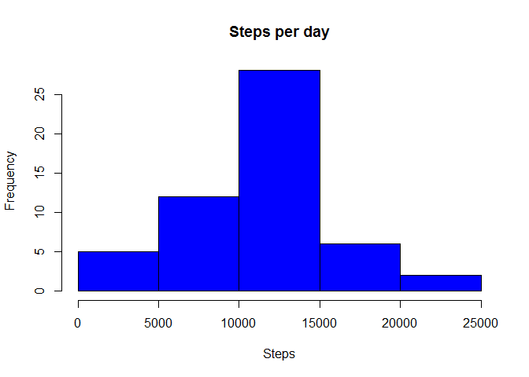
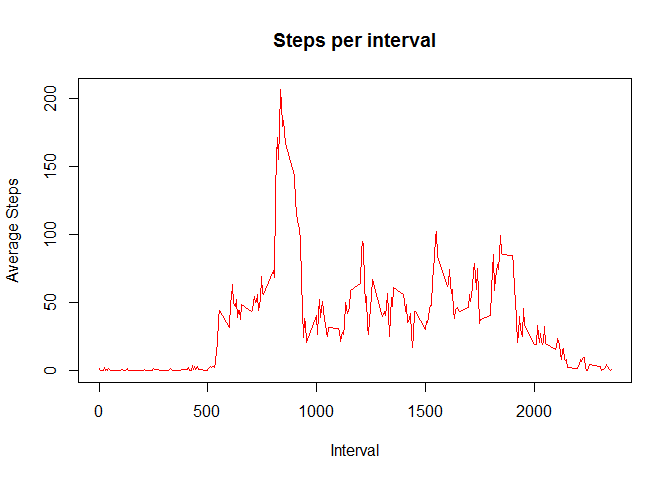
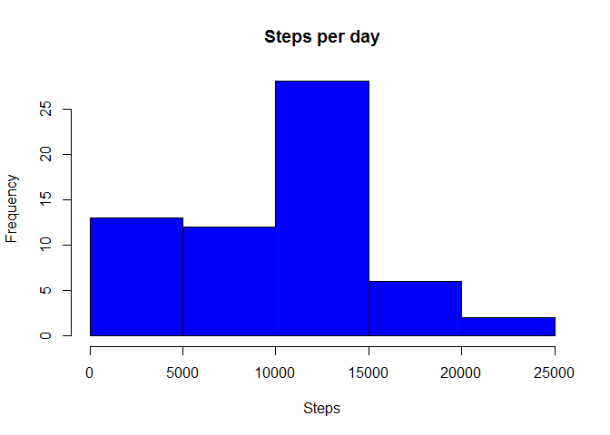
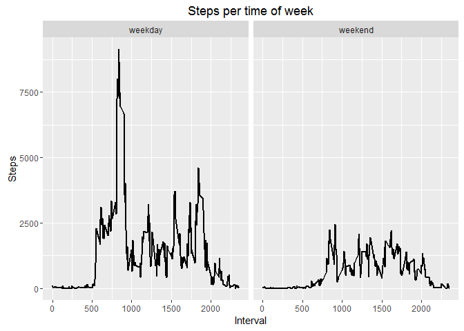

# Reproducible Research: Peer Assessment 1

## Install Packages

```r
#install packages.
library(downloader)
```

```
## Warning: package 'downloader' was built under R version 3.2.3
```

```r
library(data.table)
```

```
## Warning: package 'data.table' was built under R version 3.2.3
```

```r
library(plyr)
```

```
## Warning: package 'plyr' was built under R version 3.2.3
```

```r
library(ggplot2)
```

```
## Warning: package 'ggplot2' was built under R version 3.2.3
```

```r
library(AggregateR)
```

```
## Warning: package 'AggregateR' was built under R version 3.2.3
```

```r
library(chron)
```

```
## Warning: package 'chron' was built under R version 3.2.3
```

## Loading and preprocessing the data

```r
unzip ("activity.zip")
data <- fread("activity.csv")
data$date=as.Date(data$date, "%Y-%m-%d")
```

## What is mean total number of steps taken per day?

Aggregate data and create histogram

```r
stepsperday=aggregate(steps ~ date, data, sum)
hist(stepsperday$steps, col="blue", xlab="Steps",main="Steps per day")
```



Report mean

```r
mean(stepsperday$steps)
```

```
## [1] 10766.19
```

Report median

```r
median(stepsperday$steps)
```

```
## [1] 10765
```

## What is the average daily activity pattern?

Aggregate data and create histogram

```r
stepsperinterval=aggregate(steps ~ interval, data, mean)
plot(stepsperinterval$interval,stepsperinterval$steps, col="red", type="l", xlab="Interval", ylab="Average Steps",main="Steps per interval")
```



Report max

```r
stepsperinterval$interval[which.max(stepsperinterval$steps)]
```

```
## [1] 835
```

## Imputing missing values

Calculate total number of missing values

```r
sum(is.na(data))
```

```
## [1] 2304
```

Merge Steps per interval average with main data

```r
stepsperinterval=rename(stepsperinterval, c("steps"="AvgStepsInt"))
mergedata = merge(data,stepsperinterval,by.x="interval",by.y="interval")
mergedata$steps[is.na(mergedata$steps)] <- mergedata$AvgStepsInt
```

```
## Warning in mergedata$steps[is.na(mergedata$steps)] <- mergedata
## $AvgStepsInt: le nombre d'objets à remplacer n'est pas multiple de la
## taille du remplacement
```

Aggregate data and create histogram

```r
stepsperdaymod=aggregate(steps ~ date, mergedata, sum)
hist(stepsperdaymod$steps, col="blue", xlab="Steps",main="Steps per day")
```



Report mean

```r
mean(stepsperdaymod$steps)
```

```
## [1] 9371.437
```

Report median

```r
median(stepsperdaymod$steps)
```

```
## [1] 10395
```

## Are there differences in activity patterns between weekdays and weekends?
Identify weekends

```r
mergedata$weekend=is.weekend(mergedata$date)
weekday=subset(mergedata,mergedata$weekend==FALSE)
weekdend=subset(mergedata,mergedata$weekend==TRUE)
```

create dataframes with averages per interval for each

```r
avgweekday=aggregate(steps ~ interval, weekday, sum)
avgweekday$type="weekday"
avgweekend=aggregate(steps ~ interval, weekdend, sum)
avgweekend$type="weekend"
finalmerge=rbind(avgweekday,avgweekend)
```

plot the differences

```r
qplot(interval,steps,data=finalmerge, facets = ~ type,xlab="Interval", ylab="Steps", size=I(1), main="Steps per time of week", geom="path")
```



